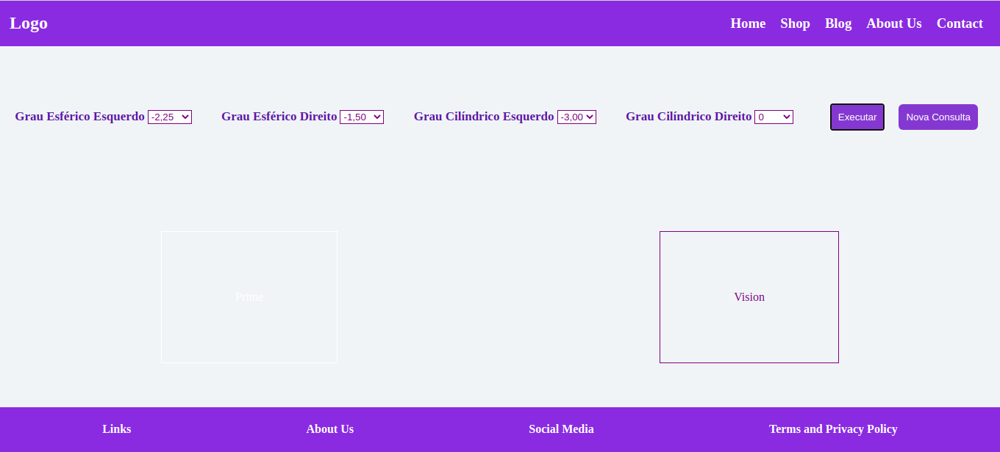

<h1 align="center">Welcome to Ocular-Len👋</h1>
<p>
  
  <a href="LICENSE" target="_blank">
    
  </a>
  <a href="https://twitter.com/andersonarorjdev" target="_blank">
    
  </a>
</p>


<h4>O que acha de ser seu próprio Oftomologista e se auto diagnosticar?😵</h4>

# Agora Voce Pode!😌. 
 Como?🤨
 - Através do Ocular Len você Pode selecionar se vai usar a Lente VISION ou PRIME. Basta selecionar os Graus Cilíndricos e Esféricos de ambos os olhos e você já sai com o seu resultado na hora, simples! Não?!🚀 

### Layout


### Resultado da Consulta


***

## Acessing the project on production:
```url
  https://get-easy-my-adress-mcr3pxena.vercel.app/
```
or you can click here: <a href="https://ocular-challenge.vercel.app/"> CLICK HERE TO ACESS</a>

## Downloading the project⬇️
```sh
  git clone https://github.com/andersonarorjdev/OCULAR-CHALLENGE.git
```

## Acessing the project on yout machine💻
- Na barra de URL do seu navegador digite:
```sh
C://USER/Folder/OCULAR-CHALLENGE/index.html
``` 
- Exemplo hipotético e que pode mudar conforme o seu sistema operacional, caminhos de pastas, etc...
## Author

👤 **Andersonarorjdev**

* Website: https://andersonarorjdev.github.io
* Twitter: [@andersonarorjdev](https://twitter.com/andersonarorjdev)
* Github: [@andersonarorjdev](https://github.com/andersonarorjdev)
* LinkedIn: [@andersonarorjdev](https://linkedin.com/in/andersonarorjdev)

## Show your support

Give a ⭐️ if this project helped you!

## 📝 License

Copyright © 2020 [Andersonarorjdev](https://github.com/andersonarorjdev).<br />
This project is [MIT](LICENSE) licensed.